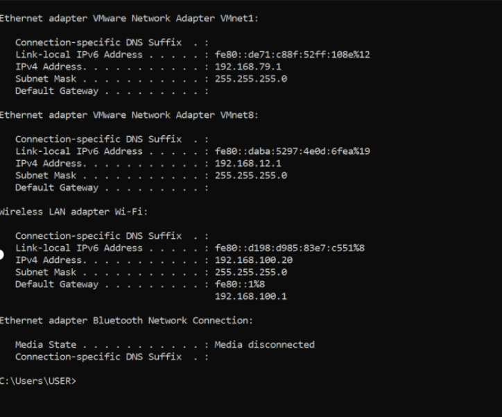
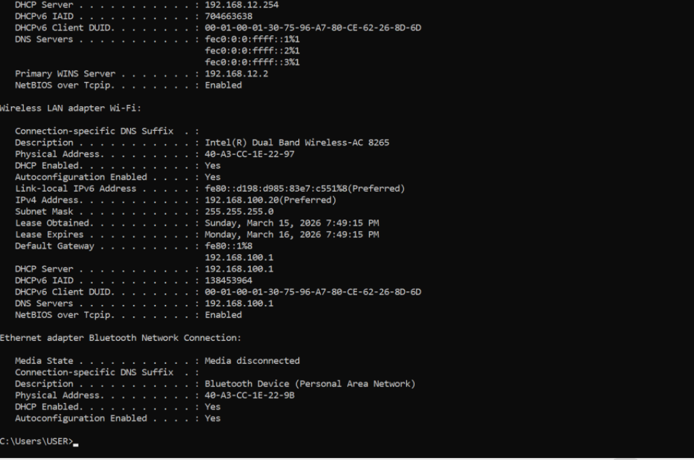
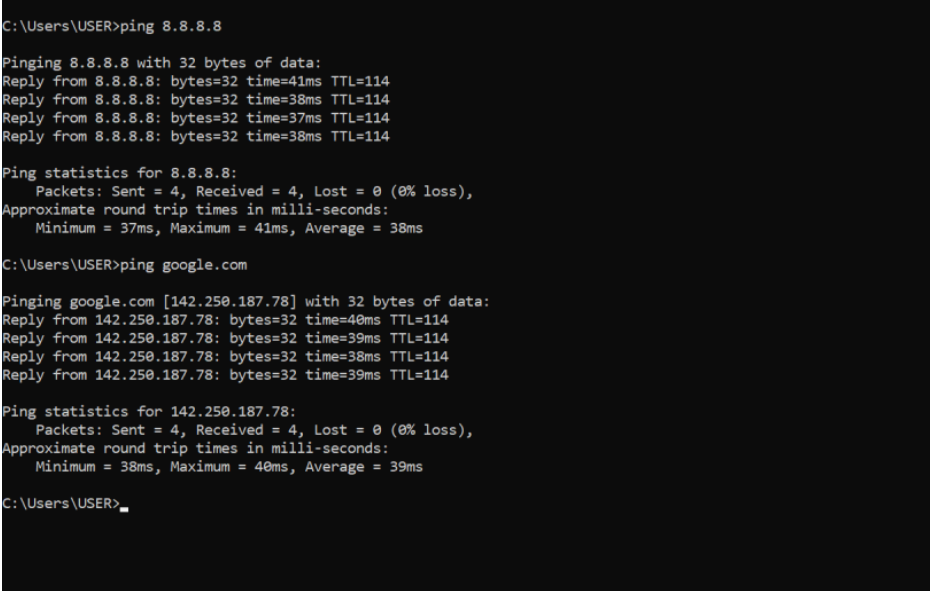

# Cyber Security Journey – Ghulam Fatima

This repository contains my daily progress in learning Cyber Security and Ethical Hacking.

---

## Day 1

* Learned Cyber Security basics
* Practiced commands: ipconfig, ping
  ## Day 1 Screenshots

### ipconfig command

### ipconfig all

### ping command

## Day 2

* Created LinkedIn profile
* Created GitHub account
* Started building my portfolio

## Day 3

* Learned Networking basics
* Studied IP (Internet Protocol)
* Understood DNS (Domain Name System)
* Learned HTTP & HTTPS difference
